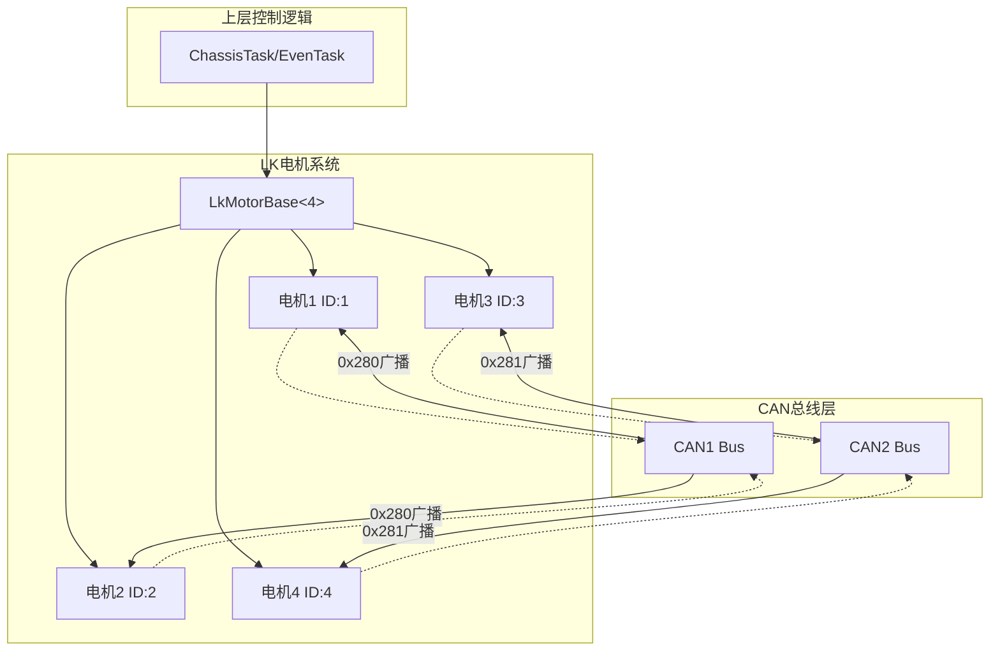

# 设计文档

## 概述

本设计实现将四个LK4005电机从单一CAN1总线分配到CAN1和CAN2两条总线。采用模板特化和CAN总线抽象的方式，在保持上层控制逻辑不变的前提下，实现电机的双总线分布式控制。

核心设计思路：
- 引入双CAN总线引用，分别管理两组电机
- 修改广播控制函数，向两条总线分别发送控制命令
- 单电机控制函数根据电机ID自动选择正确的CAN总线
- 数据解析函数同时处理两条总线的反馈数据

## 架构



## 组件与接口

### 1. LkMotorBase 类修改

```cpp
template <uint8_t N> class LkMotorBase : public MotorBase<N>
{
protected:
    // 新增：CAN总线引用
    HAL::CAN::ICanDevice* can_bus_1_;  // CAN1总线（电机1、2）
    HAL::CAN::ICanDevice* can_bus_2_;  // CAN2总线（电机3、4）
    
    // 广播ID（两条总线使用相同ID）
    static constexpr uint32_t BROADCAST_ID = 0x280;
    
    // 新增：电机到CAN总线的映射
    uint8_t motor_to_can_[N];  // 0=CAN1, 1=CAN2
    
public:
    // 修改构造函数，接受CAN总线配置
    LkMotorBase(uint16_t Init_id, 
                const uint8_t (&recv_ids)[N], 
                const uint32_t (&send_ids)[N], 
                Parameters params,
                const uint8_t (&can_mapping)[N]);  // 新增CAN映射参数
    
    // 新增：设置CAN总线引用
    void setCAN1(HAL::CAN::ICanDevice* can1);
    void setCAN2(HAL::CAN::ICanDevice* can2);
    
    // 修改：根据电机ID获取对应CAN总线
    HAL::CAN::ICanDevice& getCanBus(uint8_t motor_id);
};
```

### 2. 单电机控制函数修改

```cpp
void On(uint8_t id)
{
    // 根据电机ID选择CAN总线
    auto& can = getCanBus(id);
    
    HAL::CAN::Frame frame;
    frame.id = init_address + send_idxs_[id - 1];
    // ... 其余逻辑不变
    can.send(frame);
}

void ctrl_Torque(uint8_t id, int16_t torque)
{
    auto& can = getCanBus(id);
    // ... 其余逻辑不变
    can.send(frame);
}
```

### 3. 多电机广播控制修改

```cpp
void ctrl_Multi(const int16_t iqControl[4])
{
    auto& can1 = *can_bus_1_;
    auto& can2 = *can_bus_2_;
    
    // CAN1广播：电机1、2（使用0x280）
    if (HAL_CAN_GetTxMailboxesFreeLevel(can1.get_handle()) > 0)
    {
        uint8_t send_data_can1[8];
        send_data_can1[0] = iqControl[0] & 0xFF;
        send_data_can1[1] = (iqControl[0] >> 8) & 0xFF;
        send_data_can1[2] = iqControl[1] & 0xFF;
        send_data_can1[3] = (iqControl[1] >> 8) & 0xFF;
        send_data_can1[4] = 0;  // 占位
        send_data_can1[5] = 0;
        send_data_can1[6] = 0;
        send_data_can1[7] = 0;
        
        HAL::CAN::Frame frame1;
        frame1.id = BROADCAST_ID;  // 0x280
        frame1.dlc = 8;
        memcpy(frame1.data, send_data_can1, 8);
        can1.send(frame1);
    }
    
    // CAN2广播：电机3、4（同样使用0x280）
    if (HAL_CAN_GetTxMailboxesFreeLevel(can2.get_handle()) > 0)
    {
        uint8_t send_data_can2[8];
        send_data_can2[0] = iqControl[2] & 0xFF;
        send_data_can2[1] = (iqControl[2] >> 8) & 0xFF;
        send_data_can2[2] = iqControl[3] & 0xFF;
        send_data_can2[3] = (iqControl[3] >> 8) & 0xFF;
        send_data_can2[4] = 0;
        send_data_can2[5] = 0;
        send_data_can2[6] = 0;
        send_data_can2[7] = 0;
        
        HAL::CAN::Frame frame2;
        frame2.id = BROADCAST_ID;  // 0x280
        frame2.dlc = 8;
        memcpy(frame2.data, send_data_can2, 8);
        can2.send(frame2);
    }
}
```

### 4. 数据解析回调注册

```cpp
// 在Init.cpp中注册回调
void Init()
{
    auto& can1 = HAL::CAN::get_can_bus_instance().get_can1();
    auto& can2 = HAL::CAN::get_can_bus_instance().get_can2();
    
    // 设置电机的CAN总线引用
    BSP::Motor::LK::Motor4005.setCAN1(&can1);
    BSP::Motor::LK::Motor4005.setCAN2(&can2);
    
    // CAN1回调：处理电机1、2的反馈
    can1.register_rx_callback([](const HAL::CAN::Frame &frame) {
        BSP::Motor::LK::Motor4005.Parse(frame);
    });
    
    // CAN2回调：处理电机3、4的反馈
    can2.register_rx_callback([](const HAL::CAN::Frame &frame) {
        BSP::Motor::LK::Motor4005.Parse(frame);
    });
}
```

## 数据模型

### 电机CAN映射配置

```cpp
// 电机ID到CAN总线的映射
// 索引0-3对应电机1-4
// 值0=CAN1, 值1=CAN2
constexpr uint8_t CAN_MAPPING[4] = {0, 0, 1, 1};  // 电机1,2->CAN1, 电机3,4->CAN2

// 电机实例定义
inline LK4005<4> Motor4005{
    0x140,                    // 基地址
    {1, 2, 3, 4},            // 接收ID偏移
    {1, 2, 3, 4},            // 发送ID偏移
    CAN_MAPPING              // CAN总线映射
};
```

### CAN帧ID分配

| 电机 | CAN总线 | 接收ID | 发送ID | 广播ID |
|------|---------|--------|--------|--------|
| 电机1 | CAN1 | 0x141 | 0x141 | 0x280 |
| 电机2 | CAN1 | 0x142 | 0x142 | 0x280 |
| 电机3 | CAN2 | 0x143 | 0x143 | 0x280 |
| 电机4 | CAN2 | 0x144 | 0x144 | 0x280 |


## 正确性属性

*正确性属性是系统在所有有效执行中应保持为真的特征或行为——本质上是关于系统应该做什么的形式化陈述。属性作为人类可读规范和机器可验证正确性保证之间的桥梁。*

### Property 1: 广播控制数据正确路由

*对于任意* 四个电机的控制值数组，调用ctrl_Multi后，CAN1应收到包含电机1、2控制值的帧，CAN2应收到包含电机3、4控制值的帧。

**Validates: Requirements 2.1, 2.2**

### Property 2: 单电机控制CAN总线路由

*对于任意* 电机ID（1-4）和任意控制参数，单电机控制函数（On/Off/ctrl_Torque/ctrl_Position）应将命令发送到正确的CAN总线：电机1、2通过CAN1，电机3、4通过CAN2。

**Validates: Requirements 4.1, 4.2, 5.3**

### Property 3: 反馈数据解析正确性

*对于任意* 有效的LK电机反馈帧，Parse函数应正确解析并更新对应电机的状态数据，包括角度、速度、电流和温度。

**Validates: Requirements 3.1, 3.2**

## 错误处理

### CAN总线故障

1. **邮箱满处理**：发送前检查邮箱状态，邮箱满时跳过本次发送
2. **总线独立性**：CAN1故障不影响CAN2上电机的控制，反之亦然
3. **超时检测**：每个电机独立维护状态监视器，超时后标记为离线

### 无效参数处理

1. **电机ID越界**：对于无效的电机ID，函数应安全返回不执行操作
2. **控制值限幅**：扭矩控制值自动限制在±2048范围内

## 测试策略

### 单元测试

1. **CAN映射配置测试**
   - 验证电机1、2映射到CAN1
   - 验证电机3、4映射到CAN2
   - 验证广播ID配置正确（两条总线均使用0x280）

2. **断联检测测试**
   - 模拟电机超时，验证离线状态标记
   - 验证两条总线独立检测

### 属性测试

使用属性测试框架验证核心正确性属性：

1. **Property 1测试**：生成随机控制值数组，验证CAN帧路由正确
2. **Property 2测试**：生成随机电机ID和控制参数，验证CAN总线选择正确
3. **Property 3测试**：生成随机反馈帧数据，验证解析结果正确

### 测试配置

- 属性测试最少运行100次迭代
- 使用mock CAN总线接口进行隔离测试
- 测试标签格式：**Feature: lk-motor-can-split, Property N: [属性描述]**
