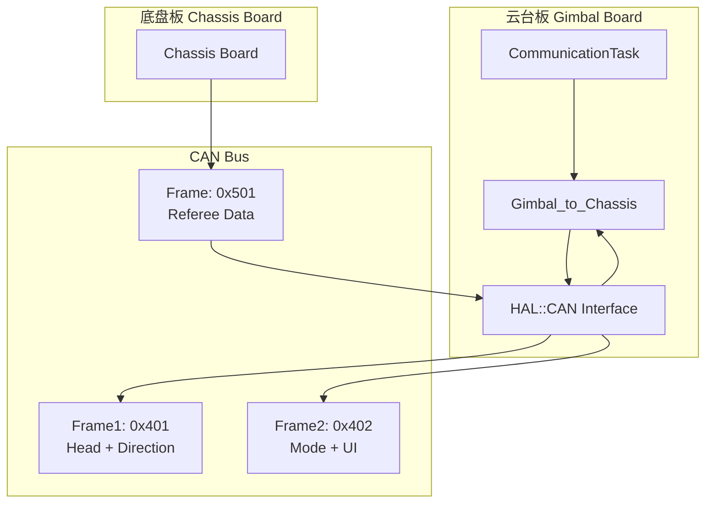

# Design Document: CAN Communication Refactor

## Overview

本设计文档描述了云台板间CAN通信的改造方案。主要目标是将现有的BSP CAN调用迁移到HAL CAN抽象层，并将发送数据从三帧优化为两帧，同时实现单帧接收裁判系统数据。

设计原则：
- 最小化修改：在现有代码基础上进行优化，不重写
- 接口兼容：保持公共API不变
- 清晰追踪：明确标注所有修改点

## Architecture



## Components and Interfaces

### 1. HAL CAN接口使用

**现有接口** (HAL/CAN/interface/can_device.hpp):
```cpp
namespace HAL::CAN {
    struct Frame {
        uint8_t data[8];
        ID_t id;
        uint8_t dlc;
        uint32_t mailbox;
        bool is_extended_id;
        bool is_remote_frame;
    };
    
    class ICanDevice {
        virtual bool send(const Frame &frame) = 0;
        // ...
    };
}
```

**调用方式变更**:
```cpp
// 旧方式 (BSP)
CAN::BSP::Can_Send(&hcan2, CAN_G2C_FRAME1_ID, can_tx_buffer[0], 0);

// 新方式 (HAL) - 使用CAN1发送
auto& can1_device = HAL::CAN::get_can_bus_instance().get_can1();
HAL::CAN::Frame frame;
frame.id = CAN_G2C_FRAME1_ID;
frame.dlc = 8;
frame.is_extended_id = false;
frame.is_remote_frame = false;
std::memcpy(frame.data, can_tx_buffer[0], 8);
can1_device.send(frame);
```

### 2. 发送帧结构设计

**数据结构大小分析**:
- Direction: 9字节 (LX:1 + LY:1 + Rotating_vel:1 + Yaw_encoder_angle_err:4 + target_offset_angle:1 + Power:1)
- ChassisMode: 1字节 (位域)
- UiList: 3字节 (位域1 + aim_x:1 + aim_y:1)
- 帧头: 1字节
- **总计**: 14字节

**两帧分配方案**:

| 帧 | CAN ID | 字节分配 | 内容 |
|---|--------|---------|------|
| Frame1 | 0x401 | 8字节 | Head(1) + Direction前7字节 |
| Frame2 | 0x402 | 8字节 | Direction后2字节 + ChassisMode(1) + UiList(3) + 填充(2) |

**帧结构详细**:
```
Frame1 (0x401): [Head][LX][LY][Rotating_vel][Yaw_err_0][Yaw_err_1][Yaw_err_2][Yaw_err_3]
Frame2 (0x402): [target_offset][Power][ChassisMode][UiList_flags][aim_x][aim_y][0x00][0x00]
```

### 3. 接收帧结构设计

**裁判系统数据帧** (0x501):
```
[Head1:0x21][Head2:0x12][cd_low][cd_high][max_low][max_high][now_low][now_high]
```

**帧头校验**: 双字节帧头 0x21 0x12，校验失败则丢弃数据。

注：由于RxRefree结构体为8字节（含2字节帧头），单帧可完整容纳。

## Data Models

### 发送数据打包

```cpp
// 新的打包方式 - 两帧
struct __attribute__((packed)) TxFrame1 {
    uint8_t head;           // 0xA5
    uint8_t LX;
    uint8_t LY;
    uint8_t Rotating_vel;
    float Yaw_encoder_angle_err;  // 4字节
};  // 共8字节

struct __attribute__((packed)) TxFrame2 {
    uint8_t target_offset_angle;
    int8_t Power;
    uint8_t chassis_mode;   // 位域打包
    uint8_t ui_flags;       // 位域打包
    uint8_t aim_x;
    uint8_t aim_y;
    uint8_t reserved[2];    // 填充
};  // 共8字节
```

### 接收数据解析

```cpp
// 单帧接收 - 带双字节帧头校验
struct __attribute__((packed)) RxFrame {
    uint8_t head1;          // 必须为0x21
    uint8_t head2;          // 必须为0x12
    uint16_t booster_heat_cd;
    uint16_t booster_heat_max;
    uint16_t booster_now_heat;
};  // 共8字节
```

## Correctness Properties

*A property is a characteristic or behavior that should hold true across all valid executions of a system-essentially, a formal statement about what the system should do. Properties serve as the bridge between human-readable specifications and machine-verifiable correctness guarantees.*

### Property 1: CAN帧发送正确性
*For any* Direction、ChassisMode、UiList数据组合，调用Data_send()后，HAL::CAN::ICanDevice::send()应被调用两次，且每次传入的Frame结构体的id、dlc、data字段应正确设置。

**Validates: Requirements 1.1, 1.3, 2.1**

### Property 2: 两帧数据打包完整性
*For any* 有效的方向数据、模式数据和UI状态数据，打包到两帧后再解包，应能还原出原始数据。

**Validates: Requirements 2.2, 2.3, 2.6**

### Property 3: 帧头校验正确性
*For any* 接收到的CAN帧数据，当且仅当帧头为0x21和0x12时，数据才会被解析到RxRefree结构体；否则原有状态保持不变。

**Validates: Requirements 3.2, 3.3, 3.4**

### Property 4: Getter/Setter一致性
*For any* 通过setter设置的值，对应的getter应返回相同的值（在有效范围内）。

**Validates: Requirements 5.3**

### Property 5: 错误处理非阻塞性
*For any* CAN发送失败或帧头校验失败的情况，系统应继续正常运行，不阻塞后续操作。

**Validates: Requirements 6.1, 6.2**

## Error Handling

### 发送错误处理
```cpp
bool send_result = can2_device.send(frame);
// 不检查返回值，允许发送失败但不阻塞
// HAL层已处理邮箱满的情况
```

### 接收错误处理
```cpp
void HandleCANMessage(uint32_t std_id, uint8_t* data) {
    // 双字节帧头校验
    if (data[0] != 0x21 || data[1] != 0x12) {
        // 静默丢弃，不影响后续接收
        return;
    }
    // 解析数据...
}
```

### 超时处理
保持现有的FRAME_TIMEOUT机制，但简化为单帧接收，无需多帧重组超时。

## Testing Strategy

### 单元测试
- 测试数据打包函数的正确性
- 测试帧头校验逻辑
- 测试getter/setter一致性

### 属性测试
使用属性测试框架验证：
- 两帧打包/解包的往返一致性
- 帧头校验的完备性
- 错误处理的非阻塞性

### 集成测试
- 验证与底盘板的实际通信
- 验证HAL CAN回调机制的正确触发

## 修改文件清单

### 需要修改的文件

| 文件 | 修改内容 |
|-----|---------|
| `Task/CommunicationTask.hpp` | 1. 移除FRAME3相关宏定义<br/>2. 更新can_tx_buffer为2帧<br/>3. 简化接收相关变量 |
| `Task/CommunicationTask.cpp` | 1. 替换BSP CAN调用为HAL CAN<br/>2. 重写Data_send()为两帧发送<br/>3. 简化HandleCANMessage()为单帧接收<br/>4. 移除include "BSP/CAN/Bsp_Can.hpp" |
| `Task/CallBack.cpp` | 1. 更新CAN接收回调中的ID判断<br/>2. 简化为单帧处理 |

### 不需要修改的文件
- `HAL/CAN/*` - 使用现有接口，无需修改
- `APP/*` - 应用层代码不受影响
- `BSP/Motor/*` - 电机通信不受影响
