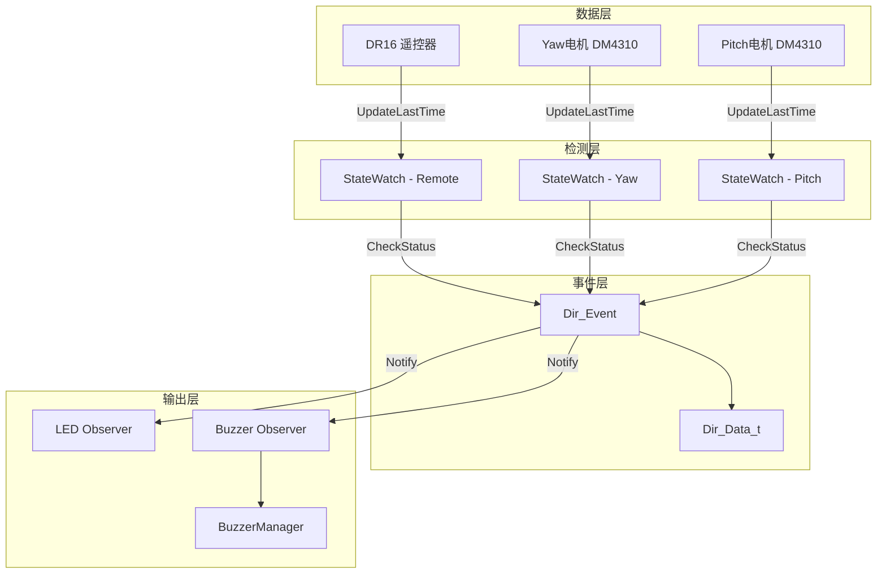
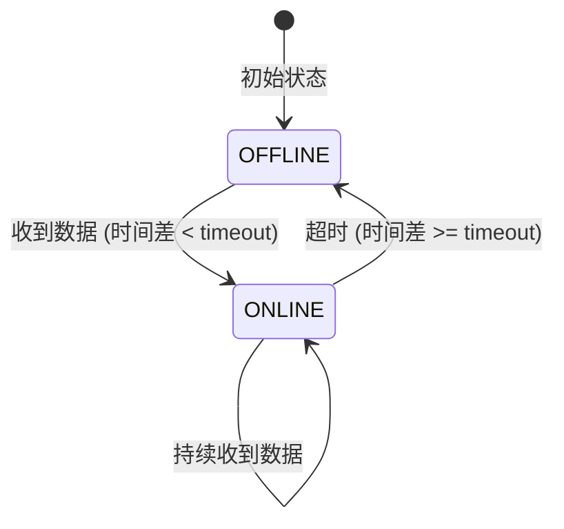

# Design Document: 断联检测系统

## Overview

本设计实现遥控器、Yaw电机和Pitch电机的断联检测系统。系统利用现有的`StateWatch`类进行超时检测，通过`BuzzerManager`发出声音提示，并通过LED显示不同颜色来指示断联设备。

整体架构基于观察者模式，`Dir_Event`作为被观察对象，`LED`和`Buzzer`作为观察者，当设备状态变化时自动通知更新。

## Architecture



## Components and Interfaces

### 1. 遥控器断联检测 (Dbus.hpp/cpp)

在`Dr16`类中添加`StateWatch`成员：

```cpp
// BSP/Remote/Dbus/Dbus.hpp
class Dr16 {
private:
    BSP::WATCH_STATE::StateWatch remote_state_watch_{50}; // 50ms超时
    
public:
    // 获取断联状态
    bool isOffline() const;
    // 在Parse中调用UpdateLastTime
};
```

### 2. 电机断联检测 (MotorBase.hpp)

电机基类已有`StateWatch`数组，需要启用`updateTimestamp`功能：

```cpp
// BSP/Motor/MotorBase.hpp
void updateTimestamp(uint8_t id) {
    if (id > 0 && id <= N) {
        state_watch_[id - 1].UpdateLastTime();
    }
}
```

### 3. 事件数据结构 (EvenTask.hpp)

更新`Dir_Data_t`结构体：

```cpp
struct Dir_Data_t {
    bool Dr16;       // 遥控器断联
    bool Yaw;        // Yaw电机断联
    bool Pitch;      // Pitch电机断联
    bool Imu;        // 陀螺仪断联
    bool InitFlag;   // 初始化标志
};
```

### 4. Dir类方法 (EvenTask.hpp/cpp)

```cpp
class Dir : public ISubject {
private:
    bool Dir_Remote();  // 检测遥控器
    bool Dir_Yaw();     // 检测Yaw电机
    bool Dir_Pitch();   // 检测Pitch电机
    
public:
    bool getDir_Remote();
    bool getDir_Yaw();
    bool getDir_Pitch();
};
```

### 5. LED颜色定义 (LED.hpp)

已有颜色定义，确认使用：
- `WHITE` (0xFFFFFFFF) - 遥控器断联
- `RED` (0xFFFF0000) - Yaw电机断联
- `BULE` (0xFF0000FF) - Pitch电机断联
- `PINK` (0xFFFFC0CB) - IMU断联

### 6. LED更新逻辑 (LED.cpp)

按优先级检测并显示颜色：

```cpp
bool LED::Update(void) {
    Dir *dir = static_cast<Dir *>(sub);
    
    // 优先级: 遥控器 > IMU > Yaw > Pitch
    if(dir->getDir_Remote()) {
        aRGB_led_show(WHITE);
        return false;
    }
    
    if(dir->getDir_IMU()) {
        aRGB_led_show(PINK);
        return false;
    }
    
    if(dir->getDir_Yaw()) {
        aRGB_led_show(RED);
        return false;
    }
    
    if(dir->getDir_Pitch()) {
        aRGB_led_show(BULE);
        return false;
    }
    
    Normal_State();
    return true;
}
```

## Data Models

### StateWatch 状态机



### 设备ID映射

| 设备 | BuzzerManager ID | LED颜色 | 优先级 |
|------|------------------|---------|--------|
| 遥控器 | 0xFF | WHITE | 1 (最高) |
| IMU | 0xFD | PINK | 2 |
| Yaw电机 | 电机CAN ID | RED | 3 |
| Pitch电机 | 电机CAN ID | BLUE | 4 (最低) |

## Correctness Properties

*A property is a characteristic or behavior that should hold true across all valid executions of a system-essentially, a formal statement about what the system should do. Properties serve as the bridge between human-readable specifications and machine-verifiable correctness guarantees.*

### Property 1: 超时检测正确性

*For any* StateWatch实例和任意时间间隔，当时间差大于等于超时阈值时，状态应为OFFLINE；当时间差小于超时阈值时，状态应为ONLINE。

**Validates: Requirements 1.1, 2.1, 3.1**

### Property 2: 状态恢复正确性

*For any* 处于OFFLINE状态的StateWatch实例，当调用UpdateLastTime后再调用CheckStatus，如果时间差小于超时阈值，状态应变为ONLINE。

**Validates: Requirements 1.4, 2.4, 3.4**

### Property 3: LED优先级显示正确性

*For any* 断联状态组合，LED显示的颜色应符合优先级规则：遥控器 > IMU > Yaw > Pitch。即如果遥控器断联，无论其他设备状态如何，LED应显示白色。

**Validates: Requirements 4.6**

## Error Handling

1. **电机重连处理**: 当DM电机断联后恢复时，需要重新发送使能命令
2. **蜂鸣器队列满**: BuzzerManager队列满时忽略新请求，避免阻塞
3. **时间溢出处理**: StateWatch已处理32位计时器溢出情况

## Testing Strategy

### 单元测试
- 测试StateWatch的超时检测逻辑
- 测试Dir_Data_t结构体的状态更新
- 测试LED颜色优先级逻辑

### 集成测试
- 测试完整的断联检测流程
- 测试观察者模式通知机制

### 硬件测试
- 实际断开遥控器/电机连接验证
- 验证蜂鸣器声音和LED颜色
