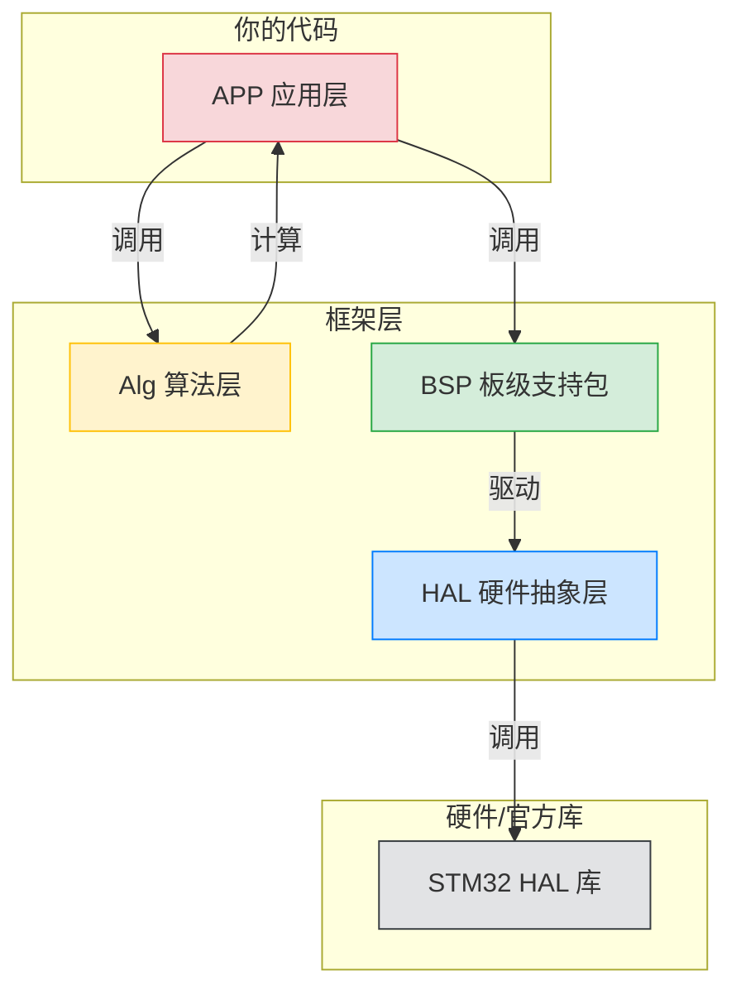
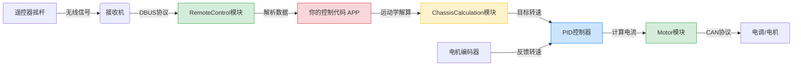

# MechaCore - 机器人核心控制框架

> RoboMaster 2026 赛季机器人核心控制代码库
>
> 📚 **适用对象**：已学习 CAN 通信基础，准备上手机器人控制代码的同学

---

## 🎯 这份代码是什么？

这是一个**机器人控制框架**，类似于一个"工具箱"，里面包含了控制机器人所需的各种模块：

- 电机怎么驱动？→ Motor 模块
- 遥控器数据怎么读？→ RemoteControl 模块
- PID 怎么用？→ PID 模块
- 底盘速度怎么解算？→ ChassisCalculation 模块

你不需要从零开始写所有代码，只需要学会**如何调用这些模块**。

---

## 🧭 新人阅读入口（建议顺序）

为了让第一次接触仓库的同学快速进入状态，建议按下面顺序看：

1. 先看本页，建立 `HAL -> BSP -> Alg -> APP` 的层次认知。
2. 再看 [BSP/Motor/README.md](./BSP/Motor/README.md)，优先跑通电机收发。
3. 再看 [BSP/RemoteControl/README.md](./BSP/RemoteControl/README.md) 和 [Alg/PID/README.md](./Alg/PID/README.md)。
4. 最后进入 `Robot/<具体兵种>/User/Task` 对照任务层代码联调。

### 📍 首日上手检查清单

- ✅ 工程能编译通过（Keil/CubeMX 环境正常）
- ✅ 串口日志可输出（便于定位问题）
- ✅ CAN 回调确实触发（不是“只发不收”）
- ✅ 至少 1 个电机能稳定闭环

### 📌 联调声明（开始前必看）

1. 文档与源码不一致时，以当前源码为准。
2. 不同兵种工程的任务划分和初始化顺序可能不同，移植代码时要逐项核对。
3. 参数（PID、限幅、滤波）禁止整车直接照搬，至少先降功率验证。
4. 调试优先级：先“能收发”，再“能闭环”，最后“跑性能”。

### ⚠️ 电机 CAN 总线硬编码提醒（高频踩坑）

当前驱动实现中，DM / DJI / LK 都存在“默认发送总线写死”的情况，不会自动跟随你的接线：

| 电机驱动 | 当前默认发送总线 | 典型风险 |
| --- | --- | --- |
| DM | CAN2 | 电机接在 CAN1 时，发送命令无效 |
| DJI | CAN1 | 电机接在 CAN2 时，发送命令无效 |
| LK | CAN1 | 电机接在 CAN2 时，发送命令无效 |

这类问题现象通常是：`Parse()` 偶尔有反馈或日志正常，但电机控制输出不生效。  
处理原则：物理接线总线、发送总线、接收回调三者必须一致。

### 🔒 其他同类风险声明（易忽略）

1. 回调声明了不等于真的执行了：要确认初始化函数已被任务调用。
2. 电机在线不等于控制链路正确：在线只代表收到反馈，不代表发送成功。
3. 单次改线后必须复核 ID、总线、回调，不要只改其中一项。
4. 新人联调默认使用小目标值和小限幅，避免直接大电流冲击机构。

---

## 📁 项目架构（重要！先理解这个）

```
core/
├── APP/                    # 🔴 应用层 - 实现具体功能
│   ├── PowerLimit/         #    功率控制（防超功率扣血）
│   └── Heat_Detector/      #    热量检测（防超热量扣血）
│
├── Alg/                    # 🟡 算法层 - 控制算法"工具箱"
│   ├── PID/                #    PID控制器（最常用！）
│   ├── ADRC/               #    自抗扰控制器（高级控制）
│   ├── FSM/                #    有限状态机
│   ├── Filter/             #    滤波器（消除噪声）
│   ├── ChassisCalculation/ #    底盘运动学解算
│   ├── Feedforward/        #    前馈控制
│   ├── Slope/              #    斜坡函数（平滑过渡）
│   └── UtilityFunction/    #    数学工具函数
│
├── BSP/                    # 🟢 板级支持包 - 设备驱动
│   ├── Motor/              #    电机驱动（3508、6020等）
│   ├── IMU/                #    IMU传感器（获取姿态）
│   ├── RemoteControl/      #    遥控器（DT7）
│   ├── Common/             #    通用组件
│   └── SimpleKey/          #    按键驱动
│
├── HAL/                    # 🔵 硬件抽象层 - 底层通信
│   ├── CAN/                #    CAN通信（你刚学完这个！）
│   ├── UART/               #    串口通信
│   ├── DWT/                #    精确计时器
│   ├── LOGGER/             #    日志打印
│   ├── PWM/                #    PWM输出
│   └── ASSERT/             #    错误检测
│
└── MatLab/                 # 🟣 MatLab生成代码
    └── PullingForce/       #    拉力计算
```

---

## 🏗️ 层次结构详解

### 为什么要分层？

想象一下盖房子：

- **地基（HAL）**：最底层，处理和硬件的直接通信（CAN、串口）
- **砖块（BSP）**：在地基上建立，封装具体设备（电机、遥控器）
- **房间（Alg）**：各种功能模块（PID、滤波器），可以随意组合
- **装修（APP）**：最终呈现给用户的功能（功率控制）



### 各层职责

| 层次    | 你需要做什么         | 举例                         |
| ------- | -------------------- | ---------------------------- |
| **APP** | 编写任务逻辑         | 写底盘控制任务、云台控制任务 |
| **Alg** | 调用算法，调参数     | 调PID参数，选择滤波器        |
| **BSP** | 初始化设备，读写数据 | 创建电机对象，获取角度       |
| **HAL** | 一般不需要改         | CAN发送已经封装好了          |

---

## 🚀 快速上手指南

### 0️⃣ 准备工作 (必读)

在开始写代码之前，请确保你的电脑上已经安装了以下工具：

- **IDE**: Keil MDK v5.30+ (推荐使用 AC6 编译器)
- **配置工具**: STM32CubeMX v6.0+
- **调试神器**: [VOFA+](https://www.vofa.plus/) (强烈推荐！用于查看 PID 波形和调试数据)
- **串口助手**: 任意串口调试助手 (如 XCOM, Vofa+ 内置也行)

### 1️⃣ 理解数据流

以**底盘控制**为例，数据的流动过程如下：



**图解说明**：

- 🟢 **绿色 (BSP)**: 负责怎么读数据、怎么发指令
- 🔴 **红色 (APP)**: 你主要写的逻辑，决定机器人怎么动
- 🟡 **黄色 (Alg)**: 帮你算数的数学工具
- 🔵 **蓝色 (Alg)**: 负责把误差变成控制量的 PID

### 第二步：学习使用电机（最重要！）

电机是你最常打交道的设备。这里以 DJI 3508 电机为例：

```cpp
// 1. 包含头文件
#include "BSP/Motor/Dji/DjiMotor.hpp"

// 2. 创建电机对象（4个电机）
BSP::Motor::Dji::GM3508<4> chassis_motor(0x200, {1, 2, 3, 4}, 0x200);

// 3. 在 CAN 接收回调中解析数据
// 当 CAN 收到电机反馈数据时，这个函数会被调用
void CAN1_RxCallback(const HAL::CAN::Frame& frame)
{
    // 把收到的 CAN 帧交给电机对象解析
    // 它会自动判断是哪个电机的数据
    chassis_motor.Parse(frame);
}

// 4. 在控制任务中读取电机数据
void ChassisTask()
{
    // 获取电机1的角度（度）
    float angle = chassis_motor.getAngleDeg(1);

    // 获取电机1的转速（rpm）
    float speed = chassis_motor.getVelocityRpm(1);

    // 获取电机1的电流（A）
    float current = chassis_motor.getCurrent(1);

    // ... 后续可以用这些数据做PID控制
}
```

**重要提示**：

- 电机 ID 从 **1** 开始，不是从 0 开始！
- `GM3508<4>` 中的 `4` 表示最多管理 4 个电机
- 3508 电机的 CAN ID 范围是 `0x201 - 0x208`
- DM / DJI / LK 默认发送总线可能不同，联调前先核对总线与回调挂载是否一致（详见 Motor 文档）

### 第三步：学习使用遥控器

```cpp
#include "BSP/RemoteControl/DT7.hpp"

// 创建遥控器对象
BSP::REMOTE_CONTROL::RemoteController remote;

// UART 接收回调
void UART_RxCallback(uint8_t* data, uint16_t len)
{
    remote.parseData(data);  // 解析遥控器数据
}

// 在任务中读取数据
void ControlTask()
{
    // 获取左摇杆数据（-1.0 到 1.0）
    float left_x = remote.get_left_x();
    float left_y = remote.get_left_y();

    // 获取右摇杆数据
    float right_x = remote.get_right_x();
    float right_y = remote.get_right_y();

    // 获取开关状态（1=上, 2=下, 3=中）
    uint8_t s1 = remote.get_s1();

    // 获取键盘按键
    bool w_pressed = remote.get_key(BSP::REMOTE_CONTROL::RemoteController::KEY_W);
}
```

### 第四步：学习使用 PID

```cpp
#include "Alg/PID/pid.hpp"

// 创建 PID 控制器
// 参数：Kp, Ki, Kd, 输出限幅, 积分限幅, 积分分离阈值
ALG::PID::PID speed_pid(10.0f, 0.1f, 0.5f, 10000.0f, 5000.0f, 500.0f);

// 控制循环（每毫秒执行一次）
void ControlLoop()
{
    float target_speed = 1000.0f;  // 目标转速 rpm
    float current_speed = chassis_motor.getVelocityRpm(1);  // 当前转速

    // 计算 PID 输出
    float output = speed_pid.UpDate(target_speed, current_speed);

    // output 就是要发给电机的电流值
}
```

---

## 📖 各模块详细文档

建议按以下顺序学习：

### 1️⃣ 先学 HAL 层（底层通信）

| 模块                             | 说明     | 优先级        |
| -------------------------------- | -------- | ------------- |
| [CAN](./HAL/CAN/README.md)       | CAN通信  | ⭐ 了解即可   |
| [UART](./HAL/UART/README.md)     | 串口通信 | ⭐ 了解即可   |
| [DWT](./HAL/DWT/README.md)       | 计时器   | ⭐ 调试时用   |
| [LOGGER](./HAL/LOGGER/README.md) | 日志     | ⭐⭐ 调试必用 |

### 2️⃣ 再学 BSP 层（设备驱动）

| 模块                                           | 说明      | 优先级        |
| ---------------------------------------------- | --------- | ------------- |
| [Motor](./BSP/Motor/README.md)                 | 电机驱动  | ⭐⭐⭐ 必学   |
| [RemoteControl](./BSP/RemoteControl/README.md) | 遥控器    | ⭐⭐⭐ 必学   |
| [IMU](./BSP/IMU/README.md)                     | IMU传感器 | ⭐⭐ 云台必学 |

### 3️⃣ 最后学 Alg 层（控制算法）

| 模块                                                     | 说明       | 优先级        |
| -------------------------------------------------------- | ---------- | ------------- |
| [PID](./Alg/PID/README.md)                               | PID控制器  | ⭐⭐⭐ 必学   |
| [Filter](./Alg/Filter/README.md)                         | 滤波器     | ⭐⭐ 信号处理 |
| [ChassisCalculation](./Alg/ChassisCalculation/README.md) | 底盘运动学 | ⭐⭐ 底盘必学 |
| [ADRC](./Alg/ADRC/README.md)                             | 自抗扰控制 | ⭐ 进阶       |

---

## 🛠️ 推荐调试技巧

### 1. 使用 VOFA+ 查看波形

PID 调不好的时候，不要瞎猜参数！使用 [VOFA+](https://www.vofa.plus/) 把 `目标值` 和 `实际值` 画出来。

- **协议**: JustFloat
- **接口**: 串口 (UART)

### 2. LED 和 蜂鸣器 (最简单的调试)

- **LED 闪烁**: 表示程序主循环在运行 (Heartbeat)
- **长鸣**: 通常表示初始化失败或电机断连
- **红灯常亮**: 可能进入了错误保护状态

---

## 💡 常见问题

### Q1: CAN 收到数据后怎么知道是哪个电机的？

每个电机都有唯一的 CAN ID（比如 3508 是 0x201-0x208）。`Parse()` 函数会自动根据 ID 判断并存储到对应位置。

### Q2: 为什么电机 ID 从 1 开始？

为了和 CAN 协议对应。3508 的 CAN ID 是 `0x201`，减去基地址 `0x200` 就是 1。

### Q3: 怎么知道电机有没有掉线？

```cpp
if (!chassis_motor.isConnected(1, 0x201))
{
    // 电机1掉线了！
    // 蜂鸣器会自动报警
}
```

### Q4: PID 参数怎么调？

PID 调参是一门"玄学"，不同系统差异很大，但通常遵循以下顺序：

1. **确定 Kp (比例)**：
   - 先把 `Ki` 和 `Kd` 设为 0。
   - 逐渐增大 `Kp`，直到系统响应够快，且**接近目标但没有超调**。
   - 此时通常会存在"稳态误差"（永远差一点点到目标）。

2. **确定 Ki (积分)**：
   - 逐渐增大 `Ki`，用于**消除稳态误差**，让系统最终能稳定在目标值。
   - 注意：`Ki` 太大会导致低频振荡或大幅超调。

3. **确定 Kd (微分)**：
   - 如果系统有超调或震荡，可以适当增加 `Kd`。
   - `Kd` 相当于"阻尼"或"刹车"，能抑制变化的趋势。

**💡 经验之谈**：

- **速度环**：通常是大 `Kp` + 适当 `Ki`，基本不用 `Kd` (因为噪音大)。
- **角度/位置环**：通常是 `Kp` + `Kd` 为主，`Ki` 很小或者只在积分分离时用。

### Q5: 电机没反应，但代码看起来都在跑？

先按顺序查这 4 项（命中率最高）：

1. CAN 物理接线是否正确（CANH/CANL、终端电阻、接插件）。
2. 发送总线是否与实际接线一致（CAN1/CAN2）：
   - DM 当前默认发 CAN2
   - DJI 当前默认发 CAN1
   - LK 当前默认发 CAN1
3. `Parse(frame)` 是否注册在对应总线回调。
4. 电机是否已使能、输出是否被限幅为 0。

如果你要把某电机从 CAN1 改到 CAN2（或反向），至少要同步改两处：

1. 驱动里的发送总线（`get_can1()` / `get_can2()`）。
2. 任务初始化里的接收回调挂载总线（`can1.register_rx_callback` / `can2.register_rx_callback`）。

### Q6: 我是新同学，遇到问题先看哪里？

1. 先看本页对应章节和模块 README。
2. 再在代码中全局搜索类名/函数名（如 `Parse`、`sendCAN`、`isConnected`）。
3. 再看同兵种历史分支或提交记录的实现方式。
4. 最后再提问，带上日志、波形和复现步骤。

### Q7: 编译能过，但下载后完全没动作？

先查这几项：

1. 任务是否启动（`MotorTask` / `ControlTask` 是否被调度）。
2. 初始化是否执行（CAN/UART/IMU init 是否在 `for(;;)` 前调用）。
3. 控制状态机是否卡在保护状态（例如未使能、急停状态）。

### Q8: `Parse(frame)` 写了但就是不进？

常见原因：

1. 回调挂在了错误总线（CAN1/CAN2 对不上）。
2. 过滤器没放行对应 ID。
3. 实际 ID 与配置的 `Init_id + recv_idx` 不一致。

### Q9: `isConnected()` 一直离线或偶发离线？

优先排查：

1. 接收频率太低，超过离线阈值。
2. 线束接触不良或终端电阻问题。
3. 控制循环堵塞（任务延时过长）导致时间戳更新不及时。

### Q10: 电机抖动/啸叫，怎么快速止损？

1. 先降限幅和目标值，必要时先关积分（`Ki=0`）。
2. 确认反馈方向与控制方向一致（正负号别反）。
3. 检查机械端是否卡滞或间隙过大，再继续调参。

### Q11: 多个电机混用时最容易错什么？

1. CAN ID 冲突。
2. 某一类电机漏注册回调。
3. 发送命令共用缓存但未按周期清零或更新。

### Q12: 新人提问时带什么信息最有效？

建议至少包含：

1. 兵种工程路径 + 分支名 + 具体改动点。
2. 复现步骤（按时间顺序）。
3. 关键日志/波形（目标值、反馈值、输出值）。
4. 你已经排查过的项（避免重复沟通）。

---

## ⚠️ 使用声明

1. 安全声明：首次上电联调请抬车或卸载执行机构，确保急停可用。
2. 版本声明：文档用于快速上手，若文档与源码冲突，以源码为准。
3. 参数声明：PID/限幅/保护参数不建议直接照搬，需结合本车重测。
4. 协议声明：电机协议和错误码以厂家文档为准，本仓库提供封装实现。

---

## 📚 命名规范

理解命名规范有助于阅读代码：

| 类型     | 规范             | 示例                            |
| -------- | ---------------- | ------------------------------- |
| 命名空间 | `大驼峰::大驼峰` | `BSP::Motor`                    |
| 类名     | `大驼峰`         | `MotorBase`, `RemoteController` |
| 函数名   | `驼峰`           | `getAngleDeg()`, `parseData()`  |
| 成员变量 | `小写_下划线_`   | `unit_data_`, `channels_`       |
| 常量/宏  | `全大写_下划线`  | `CHANNEL_VALUE_MAX`             |

---

## 📄 许可证

USTC-RCIA © 2026

---

## 🆘 遇到问题？

1. 先看对应模块的 README
2. 在代码中搜索相关函数
3. 询问学长或在群里提问
4. 对README和仓库代码有问题可以在Github里提出issue
